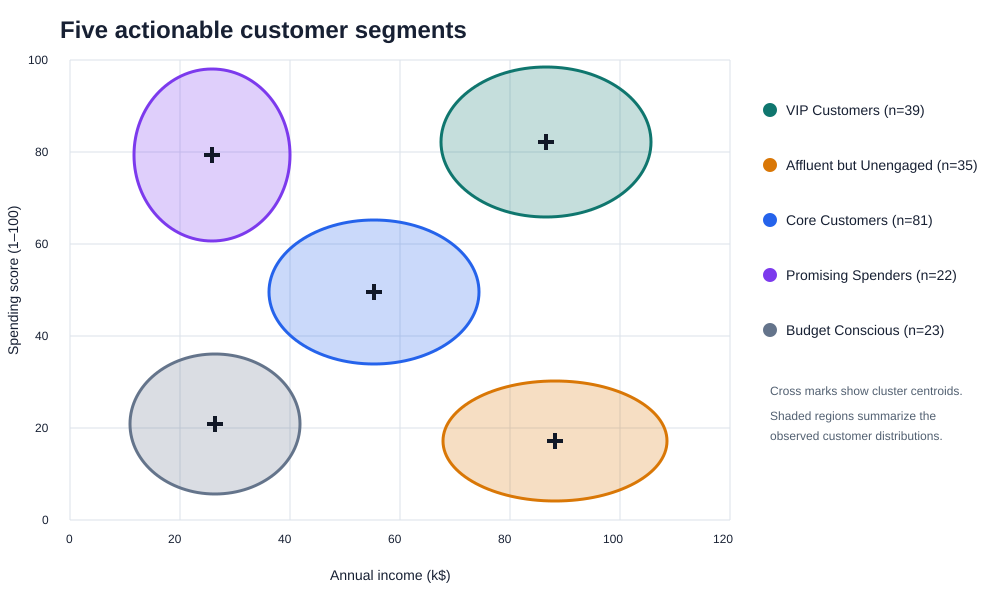
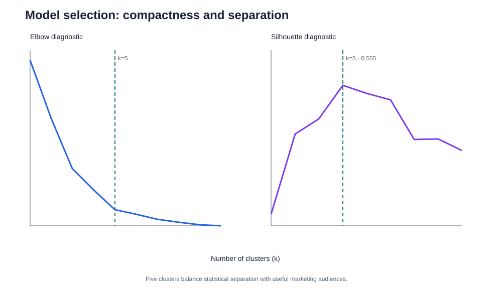
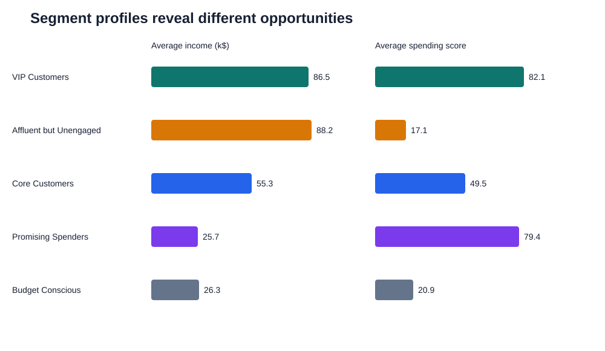

# Customer Segmentation: From Clusters to Campaigns

An end-to-end customer segmentation case study using K-Means clustering to turn customer attributes into practical marketing audiences.

## Executive summary

This analysis groups **200 mall customers into five actionable segments** using annual income and spending score. The final model achieves a **0.555 silhouette score** and exposes two especially valuable audiences:

- **39 VIP Customers** with high income and high spending.
- **35 Affluent but Unengaged customers** with high income but low spending—the clearest conversion opportunity.

The output is not merely a cluster label. Each segment is translated into a campaign objective, recommended treatment, and measurable KPI.



## Business questions

1. Which customers behave similarly?
2. Which segments should receive retention, activation, or value-oriented campaigns?
3. How can the business test whether segment-specific treatment improves results?

## Repository contents

| Notebook | Focus |
|---|---|
| [`customer-segmentation.ipynb`](customer-segmentation.ipynb) | Mall-customer exploration and comparison of clustering methods |
| [`customer-segmentation-k-means-analysis.ipynb`](customer-segmentation-k-means-analysis.ipynb) | Detailed K-Means workflow and visual analysis |
| [`customer-segmentation-and-market-basket-analysis.ipynb`](customer-segmentation-and-market-basket-analysis.ipynb) | RFM segmentation and association-rule extension for retail transactions |

## Dataset

The case study uses the public **Mall Customers** dataset: 200 customer records with customer ID, gender, age, annual income, and a retailer-defined spending score. The original notebooks reference a Kaggle input path; the data is not stored in this repository. A commonly used copy is available in the [source dataset repository](https://github.com/sharmaroshan/Clustering-of-Mall-Customers/blob/master/Mall_Customers.csv).

Income and spending score define the clusters. Age and gender are reserved for descriptive profiling after clustering, which keeps demographic attributes from determining campaign eligibility.

## Reproduce the case study

Install the core packages:

```bash
pip install pandas matplotlib scikit-learn jupyter
```

Load and validate the data:

```python
import pandas as pd

DATA_URL = (
    "https://raw.githubusercontent.com/sharmaroshan/"
    "Clustering-of-Mall-Customers/master/Mall_Customers.csv"
)

customers = pd.read_csv(DATA_URL).rename(columns={"Genre": "Gender"})

assert customers.shape[0] == 200
assert customers["CustomerID"].is_unique
assert customers.isna().sum().sum() == 0

features = ["Annual Income (k$)", "Spending Score (1-100)"]
X = customers[features]
```

### 1. Scale the features

Income and spending score have different units. Standardization prevents either variable from dominating Euclidean distance.

```python
from sklearn.preprocessing import StandardScaler

scaler = StandardScaler()
X_scaled = scaler.fit_transform(X)
```

### 2. Select the number of clusters

Use both inertia and silhouette score. The elbow measures compactness; silhouette measures separation. Five clusters provide a useful balance between statistical quality and audiences that marketers can interpret.

```python
from sklearn.cluster import KMeans
from sklearn.metrics import silhouette_score

inertias = []
silhouettes = {}

for k in range(1, 11):
    candidate = KMeans(n_clusters=k, random_state=42, n_init=20)
    labels = candidate.fit_predict(X_scaled)
    inertias.append(candidate.inertia_)
    if k >= 2:
        silhouettes[k] = silhouette_score(X_scaled, labels)

print(f"k=5 silhouette: {silhouettes[5]:.3f}")  # 0.555
```



### 3. Fit and profile the final model

`random_state` and an explicit `n_init` make the result reproducible. Cluster IDs are arbitrary, so names are assigned from centroid characteristics rather than the numeric label.

```python
model = KMeans(n_clusters=5, random_state=42, n_init=20)
customers["cluster"] = model.fit_predict(X_scaled)

centroids = pd.DataFrame(
    scaler.inverse_transform(model.cluster_centers_), columns=features
)
centroids["cluster"] = centroids.index

def segment_name(row):
    income = row["Annual Income (k$)"]
    spend = row["Spending Score (1-100)"]
    if income < 40:
        return "Promising Spenders" if spend >= 50 else "Budget Conscious"
    if income > 70:
        return "VIP Customers" if spend >= 50 else "Affluent but Unengaged"
    return "Core Customers"

centroids["segment"] = centroids.apply(segment_name, axis=1)
segment_map = centroids.set_index("cluster")["segment"]
customers["segment"] = customers["cluster"].map(segment_map)

profile = customers.groupby("segment").agg(
    customers=("CustomerID", "count"),
    average_age=("Age", "mean"),
    average_income=("Annual Income (k$)", "mean"),
    average_spending_score=("Spending Score (1-100)", "mean"),
)
print(profile.round(1))
```

## Results

| Segment | Customers | Share | Avg. age | Avg. income (k$) | Avg. spending score |
|---|---:|---:|---:|---:|---:|
| VIP Customers | 39 | 19.5% | 32.7 | 86.5 | 82.1 |
| Affluent but Unengaged | 35 | 17.5% | 41.1 | 88.2 | 17.1 |
| Core Customers | 81 | 40.5% | 42.7 | 55.3 | 49.5 |
| Promising Spenders | 22 | 11.0% | 25.3 | 25.7 | 79.4 |
| Budget Conscious | 23 | 11.5% | 45.2 | 26.3 | 20.9 |



## Campaign playbook

| Segment | Business objective | Suggested treatment | Primary KPI |
|---|---|---|---|
| VIP Customers | Retain and deepen loyalty | Early access, premium service, exclusives, referral rewards | Repeat purchase rate / retention |
| Affluent but Unengaged | Unlock latent value | Personalized discovery, category recommendations, first-purchase incentive | Conversion lift and incremental revenue |
| Core Customers | Increase frequency and basket size | Bundles, cross-sell, loyalty milestones, replenishment reminders | Purchase frequency / average order value |
| Promising Spenders | Preserve enthusiasm as value grows | Points multipliers, social campaigns, entry-level bundles | Engagement and repeat rate |
| Budget Conscious | Serve efficiently without over-discounting | Value ranges, seasonal offers, price alerts | Offer redemption and contribution margin |

Treat these actions as hypotheses. For example, randomly split the Affluent but Unengaged segment into treatment and control groups, send only treatment customers a personalized recommendation, and measure incremental conversion—not just observed conversion. See the companion [A/B Testing repository](https://github.com/JCZY999/A_B_Testing) for an experimentation workflow.

## From segmentation to production

A practical operating cycle is:

1. Score customers on a fixed cadence.
2. Join the segment label to the CRM or campaign platform.
3. Apply contact-frequency, consent, and margin guardrails.
4. Randomize treatment inside each segment.
5. Measure incremental lift, profit, unsubscribe rate, and segment migration.
6. Monitor cluster size, centroid movement, and silhouette score; retrain when drift becomes material.

## Extension: RFM and market-basket analysis

The mall dataset is useful for explaining clustering, but transactional data supports stronger decisions. The [`customer-segmentation-and-market-basket-analysis.ipynb`](customer-segmentation-and-market-basket-analysis.ipynb) notebook extends the workflow to the UCI Online Retail dataset:

- **Recency, frequency, and monetary value (RFM)** describe customer value and engagement.
- **K-Means** creates behavioral segments from standardized RFM measures.
- **FP-Growth and association rules** identify products frequently purchased together.
- Segment and basket outputs can be combined—for example, segment-specific bundles for high-value customers.

That notebook expects an external `Online Retail.xlsx` file and additional market-basket dependencies. Update its data path before running it locally.

## Limitations

- Spending score is a retailer-defined proxy, not observed revenue or profit.
- The sample is small and cross-sectional, so it cannot measure retention or customer lifetime value.
- K-Means favors roughly spherical clusters and requires the number of clusters in advance.
- Segment names are business interpretations of centroids, not ground-truth customer identities.
- Campaign value must be confirmed with randomized experiments and margin-aware outcomes.

## Conclusion

The five-cluster solution converts a simple dataset into a usable audience strategy: protect VIPs, activate affluent low spenders, grow the core, cultivate promising customers, and serve value seekers efficiently. The important next step is experimentation—segment membership suggests **who** to target, while controlled tests establish **what actually works**.
